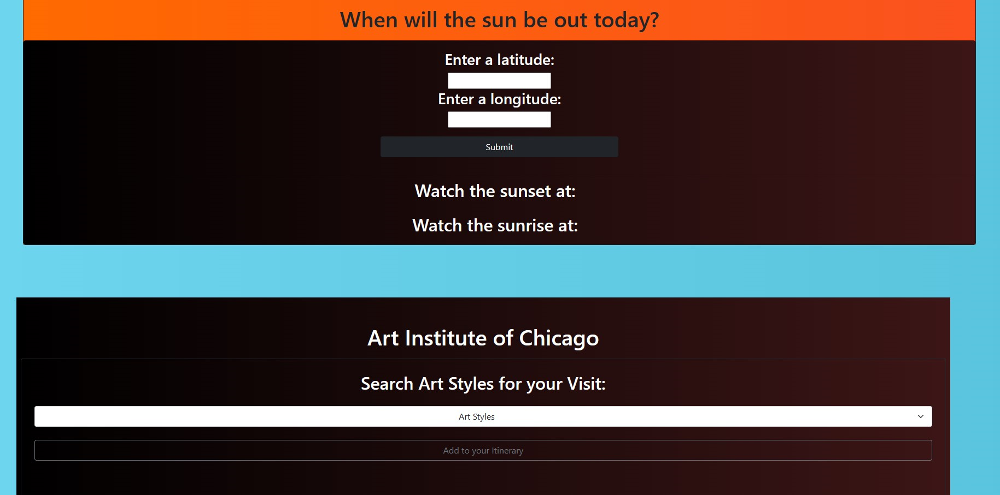
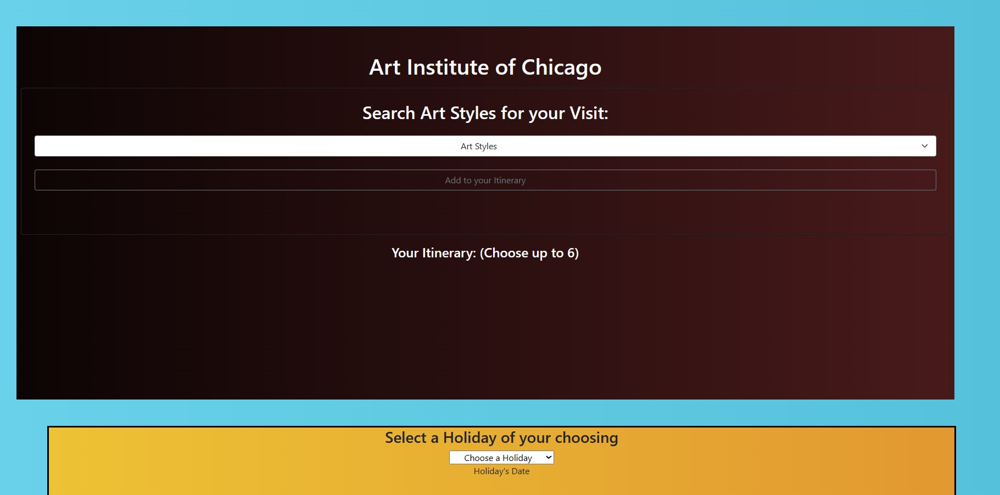

# Project-1: Interactive Front-End Application

## Our Task

The end of phase one has come and students have been tasked with collaborating with a group of fellow students to create a original **project** using the all of the tools that have been taught and learned so far. With a group of developers the goal was to tackle a real-world problem or objective that people may encounter on a daily basis. This project gives insight to what developers in the industry at all company sizes and levels handle in their roles at work. This assignment shows that coding is indeed collaborative.

To work as a team is something students have not have a chance to do so far in this bootcamp, so this switches up what has become ritual in terms of workflow in challenges. Since individuality isn't the only aspect of success in this one its important to recognize the differences in how to execute on objectives. Learning how to balance out and distribute duties amongst the group along with identifying each persons skillsets becomes a great awareness exercise and teaches the value of thinking on a larger scope.

Since this project does not come with a pre-determined vision. Students are allowed the freedom and liberty to come up with authentic ideas and can explain those clearly with a user story that is constructed based upon the real-world situation that they identified as something that needed to be addressed and solved.

And Lastly, this project is to have a well thought and designed presentation to present to the audience the importance of this creation, making it clear that it serves a purpose. Students are to think of this almost like a shark tank pitch where the instructional staff and fellow students are the investors and we are needing to convince them of taking a chance on our invention.

## User Story

```
As travelers
WE WANT to see what holidays are coming up 
SO THAT you can plan our trip to a Museum
WITH THAT we want you to know when the sun is rising and setting 
SO THAT you can make the best of this trip
OUR objective was to make a planner 
THAT ALLOWS you to see when the sunsets in any area you wish
AND WHEN you click on the dropdown of the art styles 
YOU CAN THEN choose up to six choices of what kind of tour you would like to go on during your visit
AT the end of the page 
YOU THEN will be asked to choose a holiday to plan your trip on
AND THEN you can get excited because you have now planned out a fun and adventurous road trip that came together with just a few clicks on a single page
```

## Project Requirements

Our group used everything that we've learned so far in the preceeding six modules and we've created a real-world front-end application. 

* We used CSS concepts and instructors have allowed use to tap into Bootstrap as well on this first project

* We have deployed to Github Pages

* Our project is interactive (responds to user input)

* We used at least two server-side APIs (3)

* We did not use alerts, confirms, or prompts

* Our project allows client-side storage to store persistent data

* The page and all the elements are responsive

* We have a polished UI

* Our repository is clean and meets quality coding standards like file structure, naming, indentations, comments, and other best practices for coding

* We have a quality README with a non-generic name, description, technologies used, screenshot, and link to deployed application

## Presentation Requirements

* Elevator pitch: one minute description

* Concept: Story? Motivation?

* Process: Technologies? Tasks/Roles? Challenges? Successes?

* Demo: Show and Tell

* Directions for Future Development

* Links to deployed application and Github repository

## Screenshot





* View Screenshots in the preview

### Links

Repository below

https://github.com/cpichac/project-1

Deployed page below

https://cpichac.github.io/project-1/
